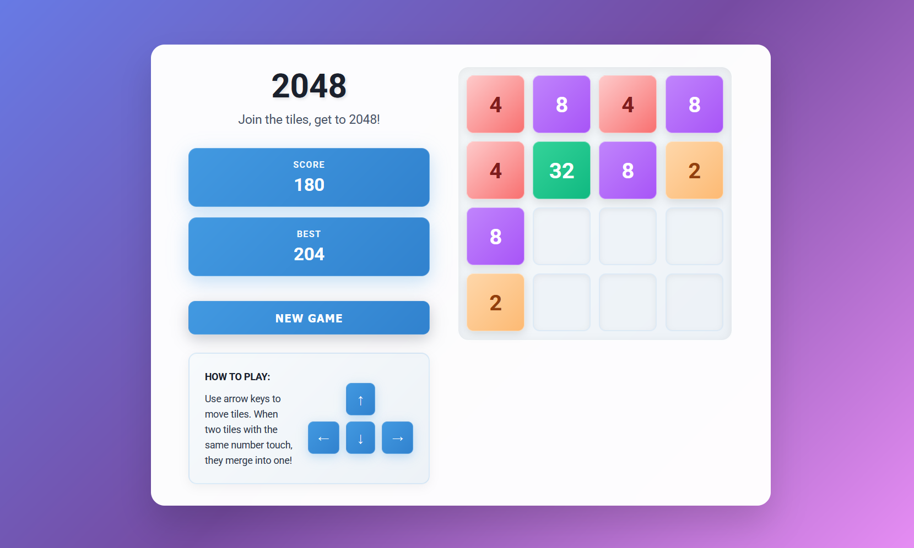

# 2048 Game

A classic sliding puzzle game where you combine numbered tiles to reach the 2048 tile.
Built with vanilla JavaScript, HTML, and CSS for smooth gameplay experience.

## Features
- Smooth tile animations and transitions
- Score tracking and game over detection
- Responsive design for mobile and desktop

## Screenshot

## Technologies Used
- HTML5
- CSS3
- Vanilla JavaScript
