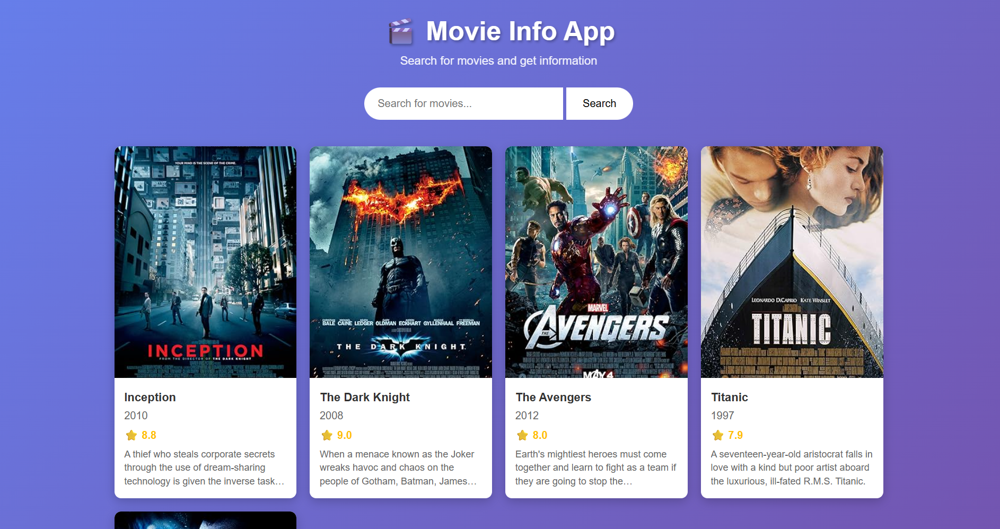
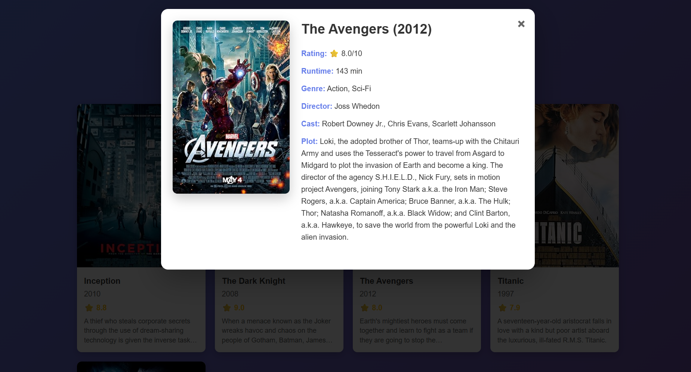

# Movie Info App

A clean and simple movie information app built with HTML, CSS, and JavaScript. Search for movies and get detailed information using the OMDB API.

## ⚡**Features**
- **Fast Search** - Quick movie search results
- **Modal Popups** - Detailed movie information
- **Responsive** - Works on desktop, tablet, and mobile
- **Keyboard Navigation** - Press '/' to search, ESC to close modal

## API
This app uses the free OMDB API (The Open Movie Database) for movie data:
- No registration required for basic usage
- Simple REST API
- Real movie data with posters and details

## Technical Features

### �️ **Built With**
- **HTML5** - Clean semantic markup
- **CSS3** - Modern styling and responsive design
- **Vanilla JavaScript** - No external dependencies
- **OMDB API** - Free movie database

