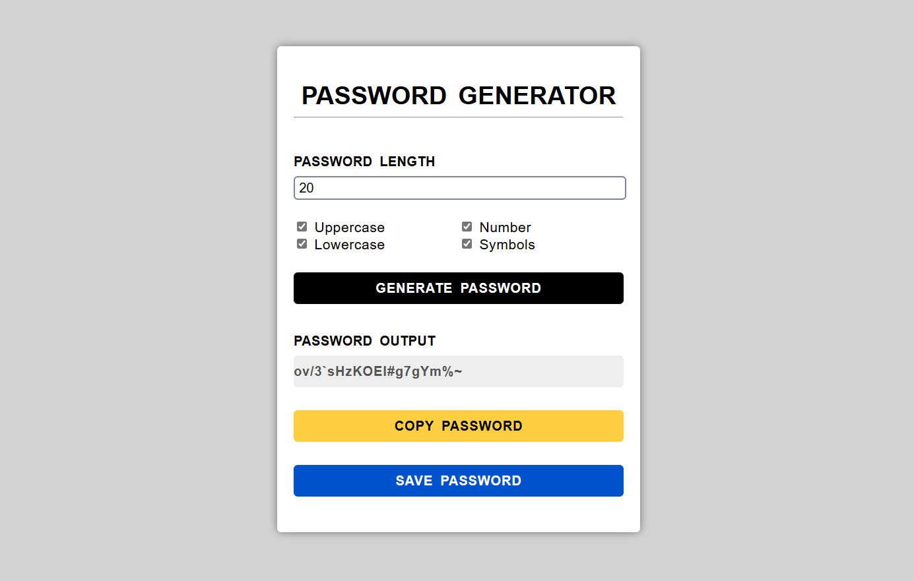

# Password Generator

Simple and effective password generator for creating secure passwords.
Generate random passwords with customizable length and character types.

## Features
- Customizable password length
- Include/exclude character types
- One-click password generation
- Copy generated passwords to clipboard
- Save passwords as text files

## Screenshot

## How to Use
1. Select desired password length
2. Choose which character types to include:
   - Uppercase letters (A-Z)
   - Lowercase letters (a-z)
   - Numbers (0-9)
   - Special characters (!@#$%^&*)
3. Click "Generate" to create password
4. Copy password to clipboard or save as file

## Technologies Used
- HTML5
- CSS3
- JavaScript
- Random character generation algorithms
