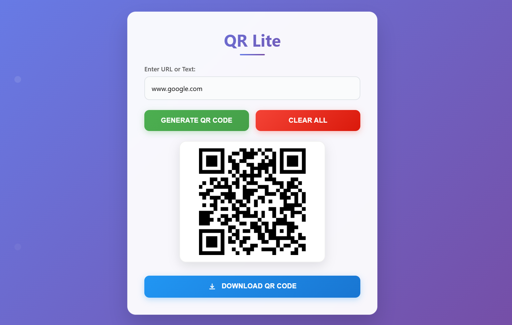

# QR Lite

Generate QR codes for text, URLs, and other data formats instantly.
Lightweight QR code generator with download and sharing options.

## Features
- Generate QR codes for various data types
- Download QR codes as images
- Clean and simple interface

## Screenshot

## Technologies Used
- HTML5
- CSS3
- JavaScript
- QR Code generation library