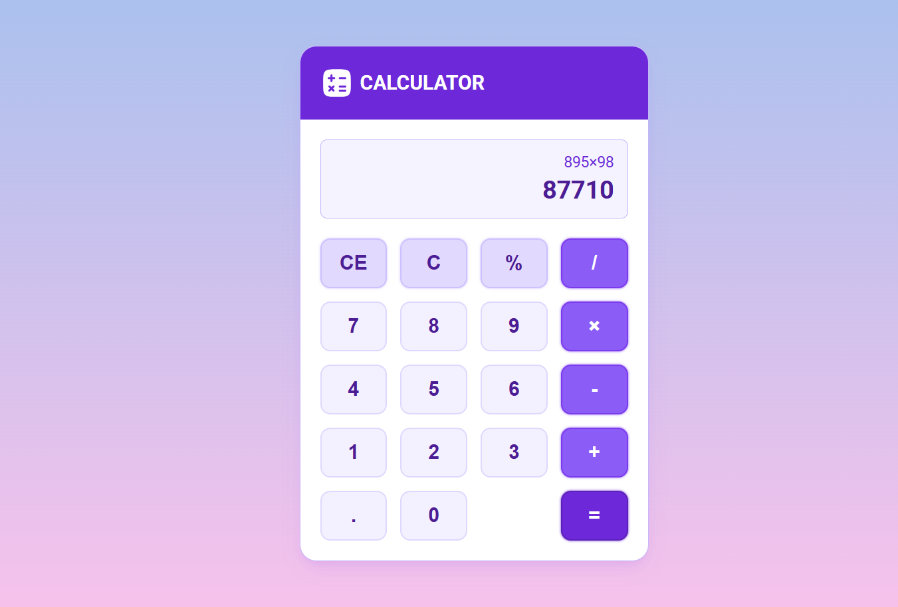

# Web Development Projects

 

 

 

## ➡️ 2048 Game
A classic sliding puzzle game where you combine numbered tiles to reach the 2048 tile.
Built with vanilla JavaScript, HTML, and CSS for smooth gameplay experience.

- Smooth tile animations and transitions
- Score tracking and game over detection
- Responsive design for mobile and desktop

 

## ➡️ Calculator
A modern calculator application with a clean interface for basic arithmetic operations.
Features standard calculator functions with keyboard support and error handling.

- Basic arithmetic operations (+, -, ×, ÷)
- Keyboard input support
- Clear and delete functionality

 

## ➡️ Currency Converter
Real-time currency converter that fetches live exchange rates from API.
Convert between multiple currencies with up-to-date conversion rates.

- Live exchange rates from reliable API
- Support for multiple currencies
- Clean and intuitive user interface

 

## ➡️ Digital Analog Clock
A beautiful dual-display clock showing both digital and analog time formats.
Features customizable themes and real-time updates every second.

- Real-time analog and digital clock display
- Multiple theme options
- Responsive design with smooth animations

 

## ➡️ Food Recipe App
Discover and explore delicious recipes with detailed cooking instructions.
Search through various cuisines and save your favorite recipes.

- Recipe search and filtering
- Detailed ingredients and instructions
- Save favorite recipes functionality

 

## ➡️ Live Code Editor
An interactive code editor that allows real-time HTML, CSS, and JavaScript editing.
See your code changes instantly with live preview functionality.
**Features:**
- Live preview of HTML, CSS, and JavaScript
- Syntax highlighting and code formatting
- Resizable editor panels

 

## ➡️ Loan Calculator
Calculate loan payments, interest rates, and repayment schedules easily.
Helps users plan their finances with detailed loan breakdown information.

- Monthly payment calculations
- Interest rate and principal breakdown
- Amortization schedule display

 

## ➡️ Mini Music Player
A compact music player with essential playback controls and playlist management.
Features modern UI design with smooth playback and volume controls.

- Play, pause, skip, and volume controls
- Progress bar with seek functionality
- Playlist management interface

 

## ➡️ Movie Info App
Search and discover movies with detailed information including ratings and reviews.
Get comprehensive movie data from popular movie databases.

- Movie search with detailed information
- Ratings, reviews, and cast details
- Responsive grid layout for movie cards

 

## ➡️ OTP Generator
Generate secure one-time passwords for two-factor authentication.
Creates random OTP codes with customizable length and expiry time.

- Secure random OTP generation
- Customizable OTP length
- Timer with expiry countdown

 

## ➡️ Password Generator 2
Advanced password generator with multiple customization options for security.
Create strong passwords with various character sets and complexity levels.

- Multiple character set options
- Password strength indicator
- Copy to clipboard functionality

 

## ➡️ Password Generator
Simple and effective password generator for creating secure passwords.
Generate random passwords with customizable length and character types.

- Customizable password length
- Include/exclude character types
- One-click password generation

 

## ➡️ QR Lite
Generate QR codes for text, URLs, and other data formats instantly.
Lightweight QR code generator with download and sharing options.

- Generate QR codes for various data types
- Download QR codes as images
- Clean and simple interface

 

## ➡️ Random Quote Generator
Get inspired with random motivational and famous quotes.
Features a collection of quotes from various authors and categories.

- Random quote generation
- Share quotes on social media
- Favorite quotes collection

 

## ➡️ Rich Text Editor
A feature-rich text editor with formatting options and document management.
Create and edit documents with various text formatting and styling options.

- Rich text formatting (bold, italic, underline)
- Font size and color customization
- Export documents in multiple formats

 

## ➡️ Text Encrypter
Secure text encryption and decryption tool for protecting sensitive information.
Uses advanced encryption algorithms to keep your text data safe and private.

- Text encryption and decryption
- Multiple encryption algorithms
- Secure key generation and management

 

## ➡️ Text To Speech
Convert written text into natural-sounding speech with voice options.
Features multiple voice selections and speech rate controls for better accessibility.

- Text-to-speech conversion
- Multiple voice options and languages
- Adjustable speech rate and volume

 

## ➡️ Url Shortener
Create shortened URLs for easy sharing and link management.
Generate compact links with click tracking and analytics features.

- URL shortening and custom aliases
- Click tracking and analytics
- QR code generation for short links

 

## ➡️ Weather App
Get real-time weather information and forecasts for any location.
Features current conditions, hourly forecasts, and beautiful weather icons.

- Real-time weather data and forecasts
- Location-based weather updates
- Beautiful weather icons and animations

 

## Contributions 🧑‍💻
Contributions are welcome! Please feel free to submit issues and pull requests.

## License 🪪
This project is licensed under the [MIT License](LICENSE).
