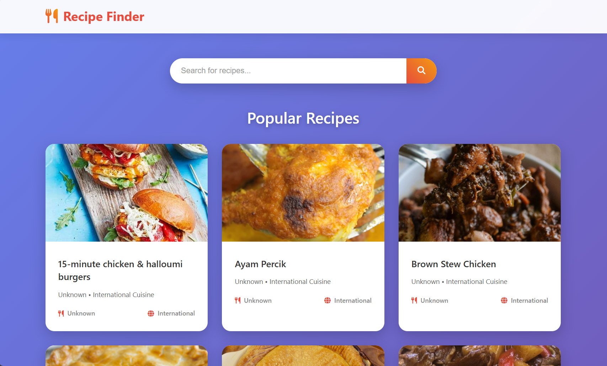
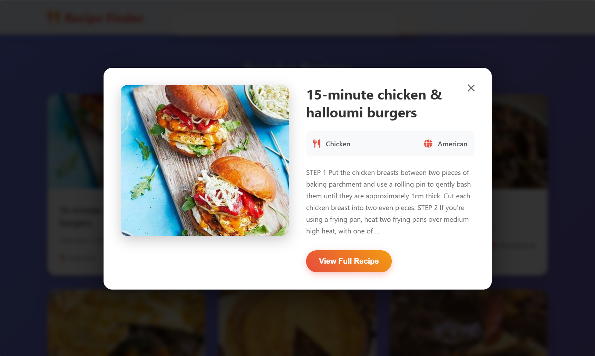

## Recipe Finder
A clean and simple recipe app built with HTML, CSS, and JavaScript. Search for recipes and get details using the Spoonacular API.


## Screenshots




## Features
- **Advanced Search** – By name, ingredients, cuisine, diet, meal type
- **Favorites** – Add/remove, persistent via localStorage
- **Recipe Details** – Images, cooking time, servings, dietary badges
- **Responsive** – Works on desktop, tablet, and mobile


## API
Uses the free Spoonacular API for recipe data:
- Requires free API key
- REST API with real recipe data


## Technical Features
- **HTML5** – Semantic markup
- **CSS3** – Modern styling, responsive design
- **Vanilla JavaScript** – No dependencies


## Quick Start
1. Get a Spoonacular API key: [Spoonacular API](https://spoonacular.com/food-api)
2. Set your API key in `index.js`:
   ```js
   this.API_KEY = 'YOUR_API_KEY_HERE';
   ```
3. Open `index.html` in your browser or run a local server:
   ```bash
   python -m http.server 8000
   # or
   npx live-server
   ```


## Troubleshooting
- **API Key Issues**: Check your key and rate limits
- **No Recipes/Images**: Verify internet/API key, refresh page
- **Favorites Not Saving**: Enable localStorage, avoid incognito mode


## License
MIT License