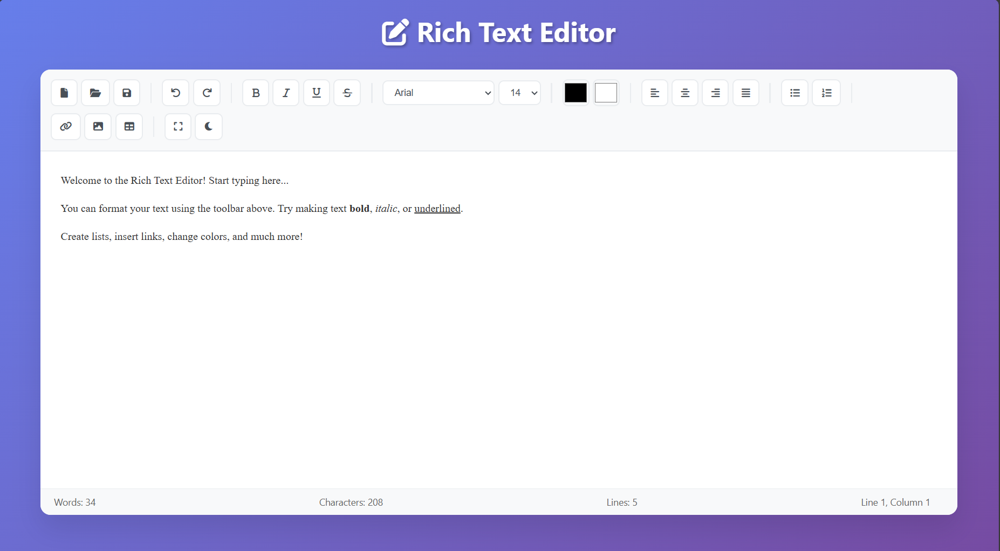

# Rich Text Editor

A modern, feature-rich text editor built with HTML, CSS, and JavaScript. This editor provides a comprehensive set of tools for creating and editing formatted documents directly in your web browser.

## Features

- **Text Formatting**: Bold, Italic, Underline, Strikethrough, font customization, and text alignment.
- **Document Management**: Create, open, save, auto-save, and print documents.
- **Content Elements**: Add lists, links, images, tables, and live preview.
- **Advanced Features**: Undo/Redo, dark mode, fullscreen, word count, and responsive design.

## Technical Features

### 🛠️ **Built With**
- **HTML5** - Semantic markup and content structure
- **CSS3** - Modern styling with Flexbox, Grid, and animations
- **Vanilla JavaScript** - No external dependencies
- **Font Awesome** - Professional icons for the toolbar

### 💾 **Local Storage**
- Automatically saves your work to browser's local storage
- Remembers dark mode preference
- Restores content when you reopen the editor

### 📱 **Responsive Design**
- Mobile-friendly interface
- Adaptive toolbar for smaller screens
- Touch-friendly controls

### 🎨 **Modern UI/UX**
- Beautiful gradient backgrounds
- Smooth animations and transitions
- Professional toolbar design
- Intuitive user interface