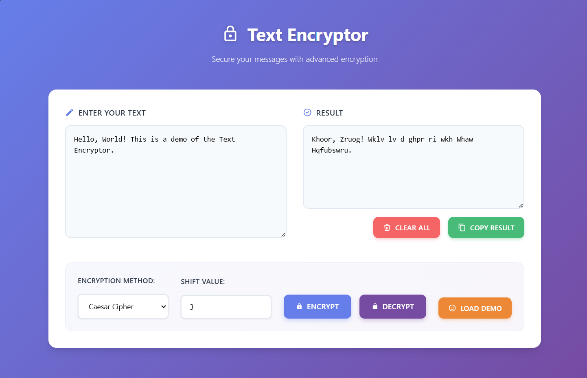

# Text Encrypter
Secure text encryption and decryption tool for protecting sensitive information.
Uses advanced encryption algorithms to keep your text data safe and private.

## Features
- Text encryption and decryption
- Multiple encryption algorithms
- Secure key generation and management

## Screenshot

## Technologies Used
- HTML5
- CSS3
- JavaScript
- Cryptographic algorithms (AES, Caesar Cipher, etc.)
- Secure key generation
