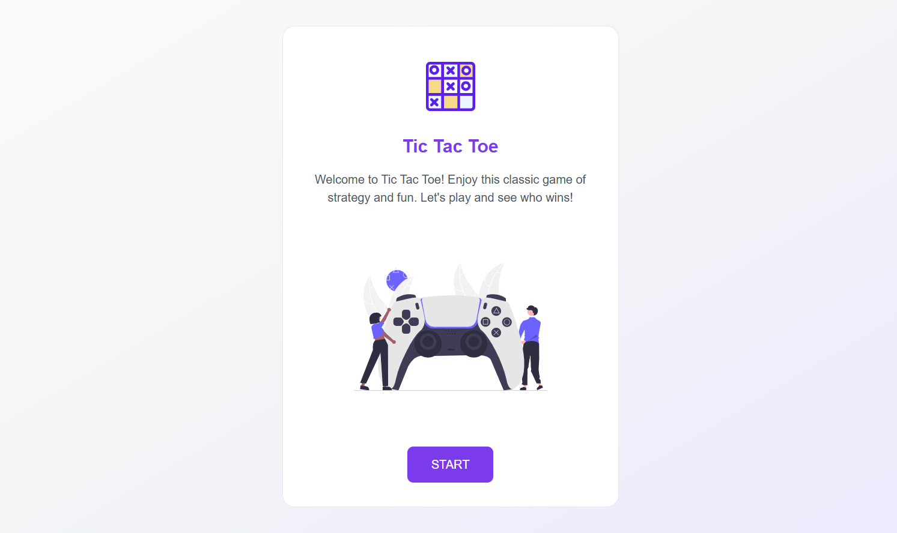
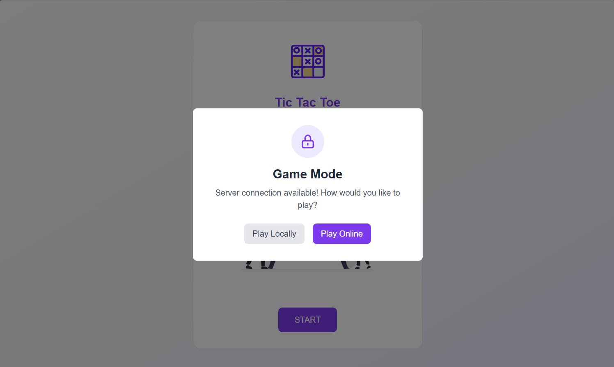
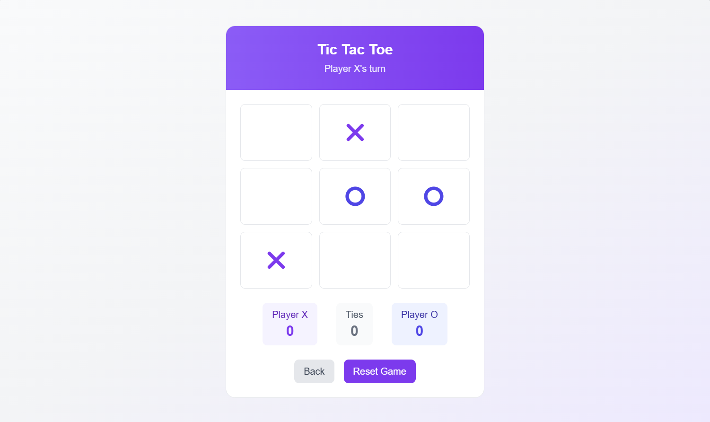
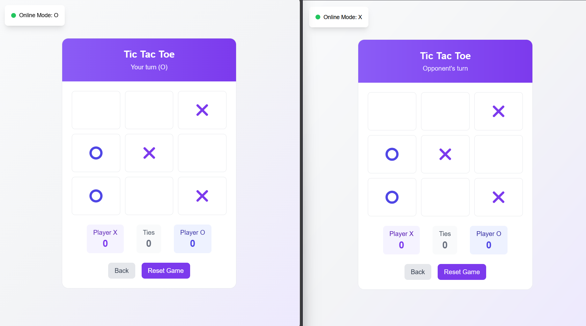
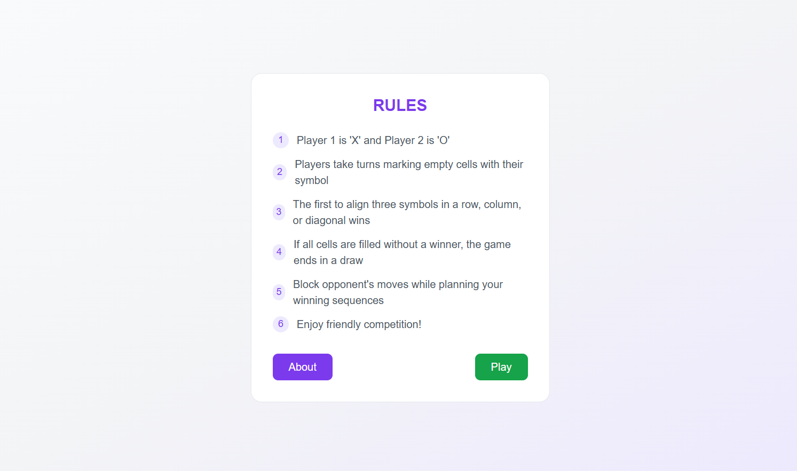
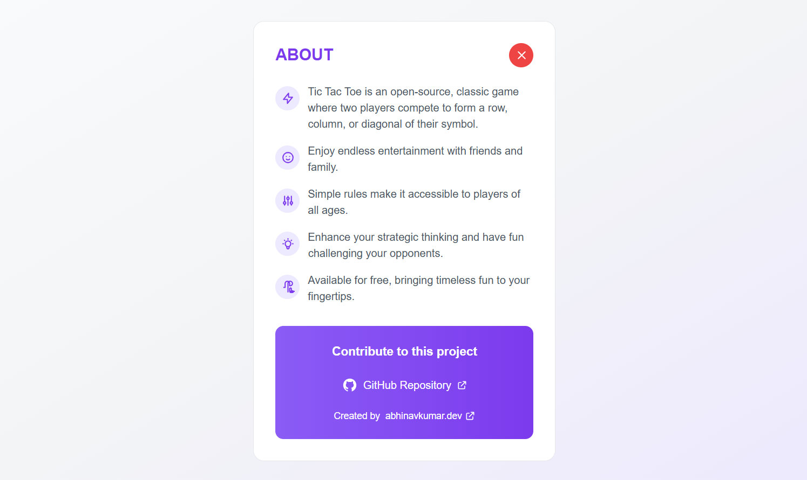

# Tic Tac Toe Web Game

A modern, interactive Tic Tac Toe game built with HTML, CSS, and JavaScript, featuring both local and WebSocket multiplayer gameplay modes.

## Features

- **Local Multiplayer**: Play against friends on the same device
- **WebSocket Multiplayer**: Real-time online gameplay with other players
- **Modern UI**: Clean, responsive design with smooth animations
- **Game Rules**: Built-in rules and instructions
- **Real-time Updates**: Instant game state synchronization for online play
- **Mobile Responsive**: Works perfectly on desktop and mobile devices

## Screenshots

### Home Screen - Local Mode


### Home Screen - WebSocket Mode


### Game Screen - Local Mode


### Game Screen - WebSocket Mode


### Game Rules


### About Screen


## Technologies Used

- **Frontend**: HTML5, CSS3, JavaScript (ES6+)
- **Styling**: Tailwind CSS for modern, responsive design
- **Backend**: Node.js with WebSocket (ws) library
- **Build Tools**: npm scripts for development and production
- **Version Control**: Git

## Installation

1. Clone the repository or navigate to the project directory
2. Install dependencies:
   ```bash
   npm install
   ```

## Usage

### Local Mode (Single Device)
Simply open `index.html` in your web browser to play locally with two players on the same device.

### WebSocket Mode (Online Multiplayer)

1. **Start the WebSocket server:**
   ```bash
   npm run server
   ```
   The server will start on the default port (usually 8080)

2. **Open the game in your browser:**
   Open `index.html` in your browser and select WebSocket mode

3. **For development (both server and client):**
   ```bash
   npm run dev
   ```

## Game Modes

### Local Multiplayer
- Two players take turns on the same device
- Classic Tic Tac Toe rules apply
- Instant gameplay without internet connection

### WebSocket Multiplayer
- Real-time online gameplay
- Connect with other players over the internet
- Synchronized game state across all connected clients
- Automatic player matching

## Game Rules

1. The game is played on a 3x3 grid
2. Players take turns placing their marks (X or O)
3. The first player to get 3 of their marks in a row (horizontal, vertical, or diagonal) wins
4. If all 9 squares are filled without a winner, the game is a draw


## Development

### Prerequisites
- Node.js (version 14.0.0 or higher)
- npm (Node Package Manager)

### Development Scripts
- `npm start` - Start the main application
- `npm run server` - Start only the WebSocket server
- `npm run dev` - Start both client and server concurrently
- `npm run web` - Start the web application
- `npm run websocket` - Start the WebSocket server

### Dependencies
- **ws**: WebSocket library for real-time communication
- **concurrently**: Run multiple npm scripts simultaneously (dev dependency)


## Future Enhancements

- [ ] AI opponent for single-player mode
- [ ] Tournament mode with multiple rounds
- [ ] Player statistics and leaderboard
- [ ] Custom themes and board designs
- [ ] Sound effects and animations
- [ ] Private room creation for WebSocket mode
- [ ] Spectator mode for ongoing games
