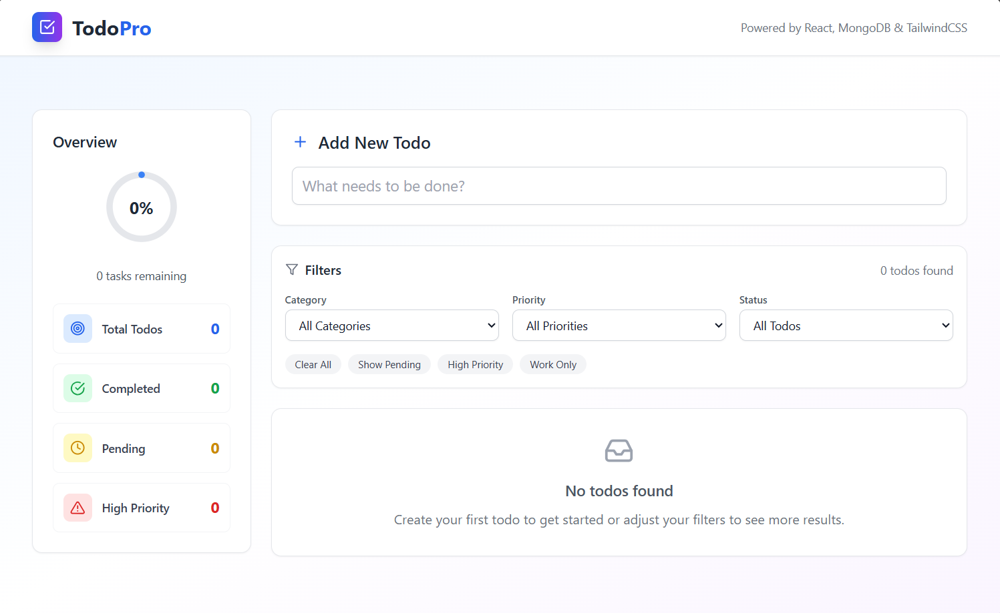

# 🚀 Todo React App

A modern, full-stack Todo application built with **React**, **MongoDB**, and **TailwindCSS**. Easily manage your daily tasks with priorities, categories, due dates, and a beautiful dashboard.

<p align="center">
  
</p>

---

## ✨ Features

- **Add, Edit, Delete Todos** – Full CRUD functionality
- **Priorities & Categories** – Organize tasks by importance and type
- **Due Dates** – Never miss a deadline
- **Filtering** – Quickly find tasks by category, priority, or status
- **Statistics Dashboard** – Track your productivity
- **Responsive Design** – Works great on desktop and mobile

---

## ⚡ Quick Start

### Backend

```bash
cd backend
npm install
echo "PORT=5000\nMONGODB_URI=mongodb://localhost:27017/todoapp" > .env
npm run dev
```

### Frontend

```bash
cd frontend
npm install
npm install -D tailwindcss postcss autoprefixer
npx tailwindcss init -p
npm start
```

---

## 🛠️ Usage

- **Add Todos**: Fill out the form to create new tasks.
- **Manage Todos**: Mark as complete, edit, or delete.
- **Filter & Stats**: Use the filter bar and dashboard to stay organized.

---

## 📁 Project Structure

```
Todo React App/
├── backend/    # Express server & API
├── frontend/   # React app & UI
├── screenshot.png
└── README.md
```

---

## 🔗 API Endpoints

| Method | Endpoint                     | Description         |
|--------|------------------------------|---------------------|
| GET    | `/api/todos`                 | Fetch todos         |
| POST   | `/api/todos`                 | Create a todo       |
| PUT    | `/api/todos/:id`             | Update a todo       |
| PATCH  | `/api/todos/:id/toggle`      | Toggle completion   |
| DELETE | `/api/todos/:id`             | Delete a todo       |
| GET    | `/api/stats`                 | Fetch statistics    |

---

## 📄 License

Licensed under the MIT License.
