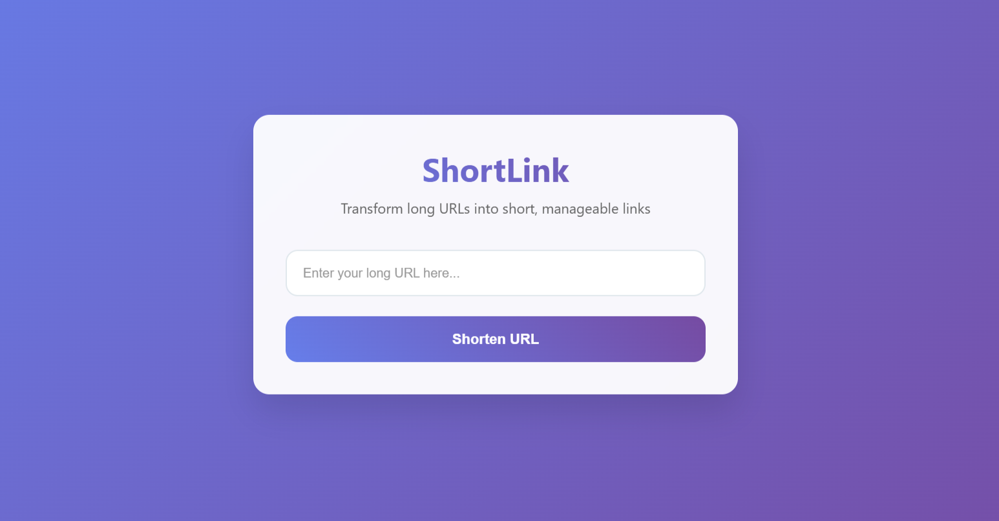

# URL Shortener
Create shortened URLs for easy sharing and link management.
Generate compact links with click tracking and analytics features.

## Features
- URL shortening and custom aliases
- Click tracking and analytics
- QR code generation for short links

## Screenshot

## Technologies Used
- HTML5
- CSS3
- JavaScript
- URL shortening algorithms
- Local storage for link management
- QR code generation library
