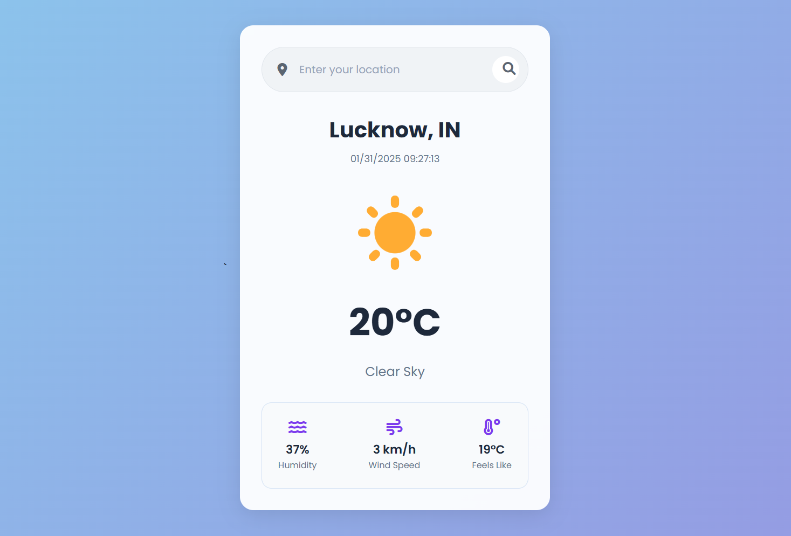

# Weather App
Get real-time weather information and forecasts for any location.
Features current conditions, hourly forecasts, and beautiful weather icons.


## Features
- Real-time weather data and forecasts
- Location-based weather updates
- Beautiful weather icons and animations
- Search weather by city name
- Display temperature, weather conditions, humidity, and wind speed
- Simple and responsive design


## Screenshot



## API Setup
Add your OpenWeather API key in the script:
```js
const apiKey = '<------- API KEY ------->';
```

## Technologies Used
- HTML5
- CSS3
- JavaScript
- OpenWeather API
- Geolocation services
- Responsive design with weather icons